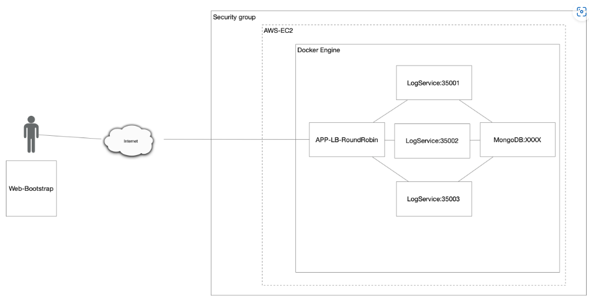

# AREP-Taller-6
En este taller se tuvo como objetivo realizar un servidor web utilizando Spark que implementara un algoritmo de balanceador de cargas para conectarse a 3 servicios distintos que escribian en una base de datos mongodb y retornaban las 10 ultimas cadenas almacenadas en la base de datos.

<br>
# TALLER 6: PATRONES ARQUITECTURALES EN AMAZON WEB SERVICES

## Para ejecutar el programa
## Descripción de la aplicación

Se puede hacer uso del comando git clone y usar la URL del repositorio:
```
https://github.com/jacro103/Arep_Lab06.git
```
Luego lo recomendado es usar Docker para utilizar el archivo docker-compose.yml el cual ya contiene la configuracion optima para el uso del servidor.

```
docker-compose up -d
```

## Prerequisitos

Es necesario tener instalado maven para compilar y probar los test del programa, si no se tiene maven puede instalar [aqui](https://maven.apache.org/install.html).


## Descripcion del programa:

### Diseño:

En este programa se usa la clase RoundRobinServer  para realizar el manejo de las peticiones GET. Esta  la clase HttpConnectionExample para realizar el llamado a los logservice y estos a su vez llaman a la base de datos para solicitar la informacion que se requiera.

### Implementacion:

#### Desarrollo servidor:

Para empezar tenemos la clase RounRobinServer.java que recibe las peticiones y retorna la pagina principal o utiliza la clase HttpConnectionExample.java para realizar las peticiones a alguno de los servicios.<br>
Este laboratorio explora patrones arquitecutrales en Amazon Web Services (AWS) y su implementación en aplicaciones web. La aplicación web es un servicio de log que almacena cadenas de texto y las muestra en una página web. Utiliza el framework [SparkJava](https://sparkjava.com/) para crear servicios REST y el motor de base de datos [MongoDB](https://www.mongodb.com/) para almacenar datos. Estos se ejecutan en contenedores Docker y se despliega en una instancia EC2 de AWS.


## Comenzando 

La clase LogService.java registra el valor recibido en la base de datos para luego llamar los ultimos 10 valores que hayan sido registrados:<br>
Las siguientes instrucciones le permitirán obtener una copia del proyecto en funcionamiento en su máquina local para fines de desarrollo y prueba.

<br>
### Requisitos 

- [Git](https://git-scm.com/) - Control de versiones
- [Maven](https://maven.apache.org/) - Gestor de dependencias
- [Java](https://www.oracle.com/java/technologies/downloads/#java17) - Lenguaje de programación
- [Docker](https://www.docker.com/) - Motor de contenedores

#### Construccion de imagenes en Docker:
> [!IMPORTANT]
> Es necesario tener instalado Git, Maven, Docker y Java 17 para poder ejecutar el proyecto.
Ahora utilizaremos el siguiente comando para construir la imagen:<br>
### Instalación 

Para la creacion de los contenedores deben usarse los comandos anteriormente mencionados:
Para ejecutar la aplicación, ejecute los siguientes comandos en la raíz del proyecto.

```
docker network create Arep_Lab06
```

```
docker run -d -p 36000:4568 --name roundrobinserver --network Arep_Lab06 jacro103/lab04taller
```


Y usando el siguiente comando verificamos el estado de los contenedores:
El anterior comando limpiará las contrucciones previas, compilará y luego ejecutará en distintos contenedores los servicios de la aplicación.

```
docker ps -a
```
Diríjase a su navegador de preferencia y vaya a la siguiente dirección: [http://localhost:8080](http://localhost:8080) para ver la aplicación en funcionamiento.

<br>
## Generando Javadoc 

Y ahora accedemos a la siguiente url y verificamos el estado del contenedor del servidor RoundRobin:
Para generar la documentación de la aplicación, ejecute el siguiente comando, los archivos Javadoc se generarán en el directorio `target/site/apidocs` dentro del proyecto.

```
http://localhost:36000
```bash
mvn site
```


Despues de ejecutar el comando anterior, abra el archivo `index.html` que se encuentra en el directorio `target/site/` con su navegador de preferencia luego búsque la sección **project reports** y haga click en la opción que dice `Project Javadoc` para ver la documentación de la aplicación.

## Arquitecura de la aplicación 

Tambien podemos validar la creacion en la aplicacion Docker Desktop:
La aplicación que describes tiene varios componentes interconectados


**Aplicación web APP-LB-RoundRobin:**

Ahora subiremos la imagen a un repositorio en la web de [Docker](https://www.docker.com).<br>
- Está compuesta por un cliente web y al menos un servicio REST.
- El cliente web tiene un campo de entrada de texto y un botón.
- Cuando un usuario envía un mensaje, el cliente web lo envía al servicio REST.
- El servicio REST procesa el mensaje y actualiza la pantalla del cliente web con la información devuelta en formato JSON.
- Implementa un algoritmo de balanceo de cargas de Round Robin para distribuir la carga entre tres instancias del servicio LogService.

Para empezar crearemos un repositorio para cada imagen, en este caso un se llamara "roundrobinserver" y el otro "logservice".<br>
**LogService:**

Y ahora haremos push para subir las imagenes al repositorio:<br>
- Es un servicio REST que recibe cadenas de texto.
- Almacena estas cadenas en la base de datos MongoDB.
- Responde con un objeto JSON que contiene las 10 últimas cadenas almacenadas y sus fechas correspondientes.

```
docker push jacro103/lab04taller:latest
```
**Servicio MongoDB:**

```
docker push jacro103/lab04taller:latest
```


## Autor
Jose Alejandro Correa Rodriguez
